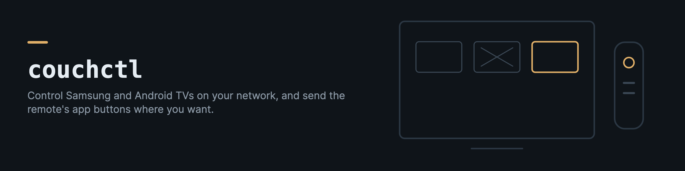

# couchctl

couchctl controls Samsung (Tizen) televisions and Android TV devices on your home network. It reads whether each screen is on, switches it on and off, opens apps, and sends the remote's app buttons to the apps you actually use.

Most remotes have buttons for apps you may never open (Prime Video, Disney+, a local streaming service). These buttons cannot be remapped on the device. couchctl watches which app is in front, and when a button opens one of those apps it opens your chosen app on top.

## Install

```bash
pip install couchctl
```

Android TV devices also need `adb` (`brew install android-platform-tools` on macOS, `apt install adb` on Debian and Ubuntu).

## Configure

couchctl reads `~/.config/couchctl/config.toml` (or the file in `$COUCHCTL_CONFIG`, or `--config`). Copy [examples/config.example.toml](examples/config.example.toml) and change the addresses.

```toml
[devices.living-room]
kind = "samsung"
host = "192.168.1.20"
mac = "aa:bb:cc:dd:ee:ff"

[[devices.living-room.redirect]]
from = "3201910019365"
to = "3201606009684"
name = "Prime Video button to Spotify"

[devices.projector]
kind = "androidtv"
adb = "192.168.1.30:5555"
```

Give each television a fixed address in your router, so the config stays correct.

## Use

```bash
couchctl state                    # on, off or unknown, for every device
couchctl pair living-room         # once per Samsung set, then choose Allow on the TV
couchctl off living-room
couchctl on living-room           # wake-on-LAN
couchctl launch living-room 3201606009684
couchctl key living-room KEY_HOME
couchctl front living-room        # which redirected app is on screen
couchctl watch                    # redirect the app buttons until stopped
couchctl watch --dry-run          # log presses without launching anything
```

## Samsung televisions

The set answers HTTP on port 8001 without a password. That is enough to read its state, see which app is in front and open an app. Remote keys (power off, home, volume) use a websocket on port 8002, and newer sets ask for permission the first time. Run `couchctl pair <device>` while the set is on, and choose Allow on the television when it asks. couchctl keeps the token the set returns in `~/.config/couchctl/tokens.json` (readable only by you) and uses it from then on.

`couchctl on` sends a wake-on-LAN packet to the `mac` in the config. The set only answers it when "Power on with mobile" is enabled (Settings, General, Network, Expert settings on most models).

A Samsung app id is the long number in the Samsung app store (3201606009684 is Spotify), or for a sideloaded app the id its package declares. To find the id behind a button, press the button and run `couchctl front <device> <id> <id> ...` with the ids you suspect, or read the list from the set with `sdb shell 0 vd_applist` if you have Tizen Studio.

## Android TV

Turn on network debugging in the device's developer options and allow the adb prompt on screen once. Apps are named by their package (`com.spotify.tv.android`), and `couchctl front` prints whatever package is in front. A device in standby usually stops answering adb, so couchctl reconnects by itself when it comes back.

Most Android TV devices cannot be woken over the network. Some projectors only wake from a Bluetooth signal sent by their own remote.

## How the redirect works

The watcher asks each device once a second which app is in front. When an app with a redirect becomes visible, it opens the replacement.

- It acts only when the app appears, so if you go back to that app on purpose it is left alone.
- When the watcher starts, or when a device comes back after being out of reach, the app already on screen is never treated as a press.
- Each device has its own thread, so a television that is off does not slow down the others.

The original app does appear for a second or two before it is replaced, and the redirect works only while the watcher runs on the same network as the screens. A Raspberry Pi is a good host for it. A systemd unit is in [examples/couchctl-watch.service](examples/couchctl-watch.service).

With `--report-url`, every redirect is also posted as JSON (device, from, to, name, outcome, message, time), with an optional bearer token read from the environment variable named by `--report-token-env`.

## Claude Code skill

```bash
couchctl skill            # copies it to ~/.claude/skills/couchctl
```

The skill gives Claude the whole procedure for taking control of a household's screens with couchctl (finding the devices and their app ids, the settings each one needs, pairing, the redirects, running the watcher) and a table of the failures we met with how to check and fix each one.

## Limits

- couchctl must be on the same network as the screens. From another network every device reads as off, so use `couchctl state --maybe-away` on a laptop that moves between networks.
- The Samsung websocket uses the set's own self-signed certificate, so that one connection is not verified.
- Tested on Samsung Tizen televisions from recent years and an XGIMI projector running Android TV.

## Development

```bash
python -m venv .venv && .venv/bin/pip install -e '.[test]'
.venv/bin/pytest
```

The tests use a fake Samsung set and a fake `adb`, so they need no hardware.

## License

MIT
